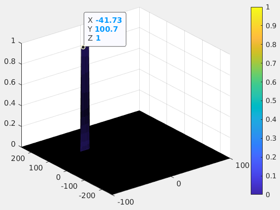

Radar Target Detection
======================

# Results

Target was placed at range of 100m and was moving at speed of -42m/s. 
Following graphs show radar processing results with target clearly visible.

1. First graph demonstrates target range detection using one pass of FFT. 
 

2. Second graph represents second pass of FFT filter (aka 2DFFT) with also esitmated velocity.

3. Third graph shows filtered 2DFFT data using CFAR which eliminates data noise without significant increase in false positives.

# Implementation steps for the 2D CFAR process.

Code lines: 154-251

Steps taken:
 - Slide the window with training and guard margins across the complete signal matrix and calculate filtered value for CUT cell in the middle of the window. 
 - For every iteration sum the signal level within all the training cells. To sum convert the value from logarithmic to linear using db2pow function. 
 - Average the summed values for all of the training cells used. After averaging convert it back to logarithmic using pow2db. 
 - Further add the offset to it to determine the threshold. 
 - Next, compare the signal under CUT against this threshold. 
 - If the CUT level > threshold assign it a value of 1, else equate it to 0. 
 
## Selection of the number of Training and Guard cells for each dimension. 
 
The number of Training and Guard cells were hand selected. 
 
The number of Training cells was determined by the rate at which noise was changing. 12 cells in range dimension and 3 in doppler dimension was enough to estimate noise threshold.

Number of guard cells for range and doppler dimensions were set at 4 and 1 respectively. This was enough to prevent target signal leakage into the training cells.

Also offset was set at 11 as the lowest value at which target was still detected while false positives were eliminated.

## Steps taken to suppress the non-thresholded cells at the edges. 

Since CFAR matrix was initialized with zeros and loop obove ignored cells at the edges the problem with edge cases was 
solved on its own with edge values being set to 0.
